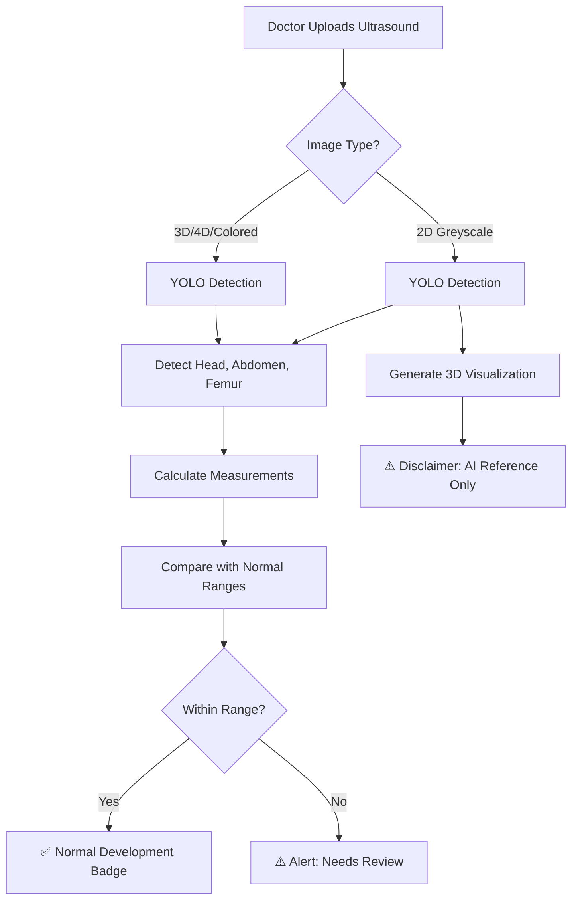

# 🧠 YOLO Ultrasound AI + Supabase Backend — Research & Plan

## 1. Supabase as Backend (✅ Perfect Fit)

Supabase is an **excellent choice** for YumiCare. It replaces the empty Express/PostgreSQL backend with a fully managed solution:

### Why Supabase Works
| Feature | What It Gives YumiCare |
|---------|----------------------|
| **PostgreSQL Database** | Store patients, vitals, appointments, prescriptions — all properly relational |
| **Auth (Built-in)** | Email/password, magic links, Google/Apple login — replaces our mock auth |
| **Row Level Security (RLS)** | Patients see only their data, doctors see only their patients |
| **Real-time subscriptions** | Live chat messages, instant notification updates |
| **Storage (S3-compatible)** | Upload ultrasound images directly — up to 5GB free tier |
| **Edge Functions** | Run YOLO inference server-side (or route to a Python backend) |
| **Free tier** | 500MB database, 1GB storage, 50K auth users per month — enough for MVP |

### Install (React Native / Expo)
```bash
npx expo install @supabase/supabase-js @react-native-async-storage/async-storage react-native-url-polyfill
```

### Supabase Schema for YumiCare
```sql
-- patients, doctors, hospitals, admins → auth.users + profiles table
-- vitals, appointments, prescriptions, chat, ultrasounds → separate tables
-- RLS policies enforce: patient sees own data, doctor sees assigned patients
```

---

## 2. YOLO for Ultrasound Analysis

### What YOLO Can Detect in Fetal Ultrasounds

YOLO (specifically **YOLOv8** or **YOLOv11**) can be trained to detect and classify:

| Detection Target | Clinical Relevance | Difficulty |
|-----------------|-------------------|-----------|
| **Fetal Head (BPD)** | Head circumference → growth tracking | ⭐⭐ Medium |
| **Abdomen (AC)** | Abdominal circumference → weight estimation | ⭐⭐ Medium |
| **Femur (FL)** | Femur length → gestational age | ⭐⭐ Medium |
| **Brain structures** | CSP, LV, 4th ventricle → anomaly detection | ⭐⭐⭐ Hard |
| **Fetal Heart** | 4-chamber view → cardiac screening | ⭐⭐⭐ Hard |
| **Placenta position** | Placenta previa detection | ⭐⭐ Medium |
| **Amniotic fluid** | Oligohydramnios/Polyhydramnios | ⭐⭐⭐ Hard |

### How the Flow Would Work in YumiCare



---

## 3. Available Datasets (Free & Public)

> [!IMPORTANT]
> These are the actual datasets you can download RIGHT NOW to train YOLO:

### 🏆 Best Datasets for YumiCare

| # | Dataset | Images | What It Contains | Format | Where to Get |
|---|---------|--------|-----------------|--------|-------------|
| 1 | **FETAL_PLANES_DB** | 12,400+ | Abdomen, Brain (6 sub-planes), Femur, Thorax | PNG + Labels | [Zenodo](https://zenodo.org/records/3904280) |
| 2 | **Fetal Head Biometry** | 3,832 | Head, Brain, CSP, Lateral Ventricles | **YOLO format ready!** | [Zenodo](https://doi.org/10.5281/zenodo.8265464) |
| 3 | **FetalBiometry-MultiCentre** | 4,513 | BPD, OFD, TAD, APAD, FL landmarks | Landmark annotations | [Figshare](https://figshare.com/articles/dataset/FetalBiometry-MultiCentre-Landmarks/27855322) |
| 4 | **Fetal Intracranial Structures** | 1,528 | 9 brain structures (thalami, midbrain, etc.) | Bounding boxes | [Kaggle](https://www.kaggle.com/datasets) — search "fetus framework" |
| 5 | **Roboflow Community** | Varies | Various fetal anatomy | YOLO export | [Roboflow Universe](https://universe.roboflow.com) — search "fetal ultrasound" |

### 🔍 Search Keywords for More Datasets

```
Kaggle:
  "fetal ultrasound segmentation"
  "fetal anatomy detection"
  "prenatal ultrasound dataset"
  "fetal biometry dataset"
  "fetal head circumference dataset"

Roboflow Universe:
  "fetal ultrasound"
  "fetus detection"
  "fetal head"
  "prenatal anatomy"

Google Dataset Search:
  "fetal ultrasound YOLO annotation"
  "fetal plane classification dataset"
  "prenatal imaging labeled dataset"

Research Papers (with linked datasets):
  "FETAL_PLANES_DB" (12K+ images)
  "HC18 Grand Challenge" (fetal head)
  "JNU-IFM dataset" (fetal movement)
```

---

## 4. Training YOLO for Ultrasound (Step-by-Step)

### Tech Stack Needed
```
Python 3.10+
ultralytics (YOLOv8/v11)
torch + torchvision (PyTorch)
opencv-python
roboflow (for easy dataset download)
```

### Training Code
```python
from ultralytics import YOLO

# Start with pretrained model
model = YOLO("yolov8m.pt")  # Medium model — good accuracy/speed balance

# Train on fetal ultrasound data
results = model.train(
    data="fetal_data.yaml",  # Your dataset config
    epochs=100,
    imgsz=640,
    batch=16,
    name="yumicare_fetal_v1",
    augment=True,
    mosaic=0.5,
    flipud=0.5,  # Ultrasounds can be flipped
)
```

### `fetal_data.yaml` example:
```yaml
path: /datasets/fetal_ultrasound
train: train/images
val: val/images

names:
  0: fetal_head
  1: fetal_abdomen
  2: fetal_femur
  3: fetal_brain
  4: placenta
  5: amniotic_fluid
  6: fetal_heart
```

### Deploy Model
- **Export to ONNX** → Run on Supabase Edge Function or a Python FastAPI server
- **Export to TensorFlow Lite** → Run on-device in React Native (faster, offline)
- **Use Roboflow Inference API** → Hosted cloud inference (easiest, no server needed)

---

## 5. 2D → 3D Visualization (Reference Model)

For converting 2D ultrasound to a 3D-like visualization:

### Approach 1: Pre-made 3D Fetal Models (Recommended for MVP)
- Use a **library of pre-modeled 3D fetal models** at different gestational ages (12w, 16w, 20w, 24w, 28w, 32w, 36w, 40w)
- When a 2D ultrasound is uploaded → YOLO detects gestational age from measurements → display the matching 3D model
- **Libraries**: Three.js (web), expo-three (React Native), or pre-rendered rotating GIF/video

### Approach 2: AI Depth Estimation (Advanced)
- Use a **monocular depth estimation model** (like MiDaS or DepthAnything) to generate a depth map from 2D ultrasound
- Convert depth map → 3D mesh → render with Three.js
- This creates a *pseudo-3D* effect from the actual 2D image

### Both approaches MUST show:
```
⚠️ DISCLAIMER: This 3D visualization is AI-generated for reference purposes only.
   It does NOT represent the actual anatomy. Always consult your healthcare provider
   for clinical interpretation.
```

---

## 6. Database Architecture with Supabase

### Tables Needed

```sql
-- Core tables (replace current AsyncStorage)
users, patients, doctors, hospitals

-- Clinical data
vitals, appointments, prescriptions, medications

-- Ultrasound AI
ultrasound_uploads (
  id, patient_id, doctor_id, 
  image_url,          -- Supabase Storage URL
  scan_type,          -- '2d' | '3d' | '4d' | 'color_doppler'
  gestational_week,
  ai_detections,      -- JSONB: YOLO results (bounding boxes, classes, confidence)
  measurements,       -- JSONB: {bpd: 61mm, hc: 220mm, ac: 195mm, fl: 44mm}
  ai_health_status,   -- 'normal' | 'review_needed' | 'anomaly_detected'
  ai_confidence,      -- 0.0 to 1.0
  doctor_notes,
  created_at
)

-- Chat (real-time with Supabase Realtime)
chat_messages (
  id, conversation_id, sender_id, sender_role,
  content, message_type, media_url,
  created_at
)

-- Audit trail
audit_logs (id, user_id, action, entity, details, created_at)
```

### Storage Buckets
```
ultrasound-images/     → Original uploaded scans
ultrasound-ai-results/ → YOLO annotated images
patient-documents/     → Reports, prescriptions PDFs
```

---

## 7. Architecture Decision

> [!IMPORTANT]
> The YOLO model **cannot run directly in React Native**. You need a backend inference server.

### Option A: Supabase Edge Function + External API (Recommended)
```
React Native → Upload to Supabase Storage → Trigger Edge Function → 
Call Python FastAPI (with YOLO) → Save results back to Supabase → 
React Native gets results via Realtime subscription
```

### Option B: Roboflow Hosted Inference (Easiest)
```
React Native → Upload image → Call Roboflow API → Get YOLO results → 
Save to Supabase → Display
```
- Roboflow offers free 1000 inferences/month
- No server management needed

### Option C: Self-hosted FastAPI (Full Control)
```
Python FastAPI server with:
  - YOLOv8 model loaded
  - /predict endpoint
  - Accepts ultrasound image
  - Returns: detections, measurements, health assessment
  - Deployed on Railway/Render/Fly.io
```

---

## Open Questions

> [!WARNING]
> 1. **Scope**: Do you want me to implement Supabase + YOLO integration NOW (massive effort, ~2-3 days), or should I first finish the current frontend improvements (the 6 phases we're already building)?
> 2. **YOLO Training**: Do you have a GPU machine or Google Colab access? Training YOLO needs GPU (~2-4 hours on Colab).
> 3. **3D Visualization**: Should I use pre-rendered 3D model GIFs (simple) or actual Three.js rendering (complex)?
> 4. **Roboflow vs Self-hosted**: Should I use Roboflow's free API for YOLO inference (easy, 1000 calls/month free) or set up a self-hosted Python server?

